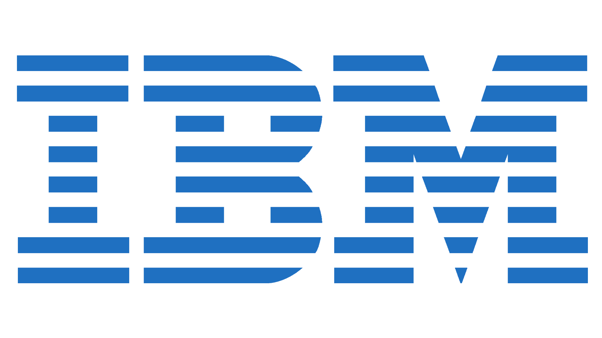

# 
**Hey Everyone! I'm [Kaustav Sarkar](https://github.com/Kaustav-Sarkar)** 

# 
**[Portfolio](https://kaustav-sarkar-portfolio.netlify.app/)** 

  
&nbsp;

&nbsp;

&nbsp;

&nbsp;

&nbsp;

  

## 
<b><h3 align="center"><samp>I am a problem solver and tech enthusiast with a keen interest in software development, cloud computing, and emerging technologies. I enjoy exploring different domains and solving challenging problems. Constant learning and growth are my primary driving forces in this ever-changing technological landscape.</samp></h3></b>

   

- 👷 <samp>SDE at Cloudera

<h3><b><samp>Experiences:</samp></b></h3>
-    <samp>Software Developer (Jan 2023 - Present) 
-    <samp>Software Developer and Cloud Devops Intern (Sep 2021 - Jan 2023) 
-    <samp>Software Developer GRM Intern (May 2022 - July 2022) 
-    <samp>AI Member of Project Manas (May 2021 - July 2022) 
- 🔬 <samp>Research Intern at Manipal Institute of Technology (Mar 2021- Sep 2021) 
- 🕵🏻 <samp>AI Intern at Innovation Center Manipal(Sep 2020 - Dec 2020) 

##
<h3><b><samp>Skills and Languages</samp></b></h3>

<!--  -->
  
    
##
<h3><b><samp>Tools and Platform</samp></b></h3>

<!--  -->
<!-- 
 -->

<!--  -->
  

### Spotify Playing 🎧

 
 
 

  
## Github Stats
  

  <a href="https://github.com/kaustav-sarkar">
    
    
    
    
    </a>

### 🏆 GitHub Profile Trophy:

### 📈 GitHub Activity:

 
 

 
  Visitor count 
  

  

